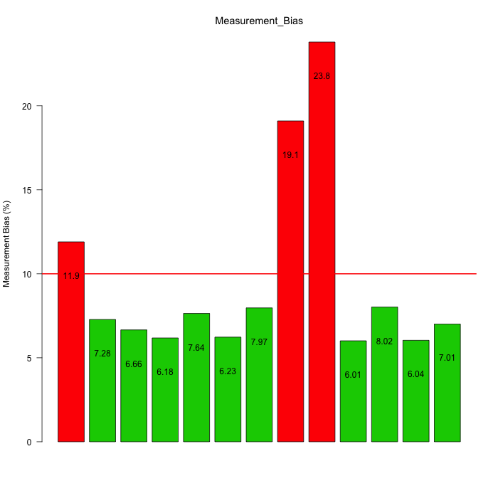
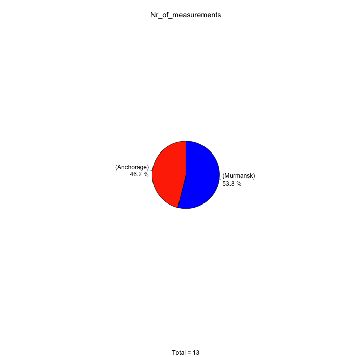
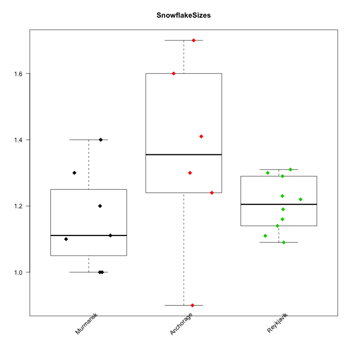
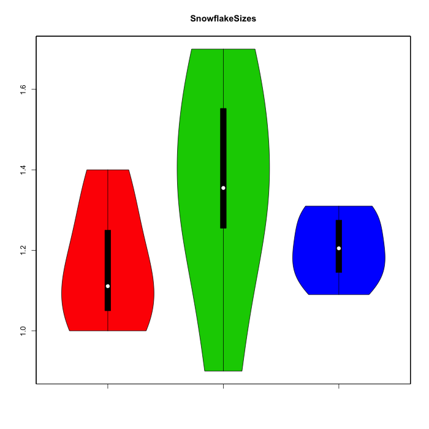
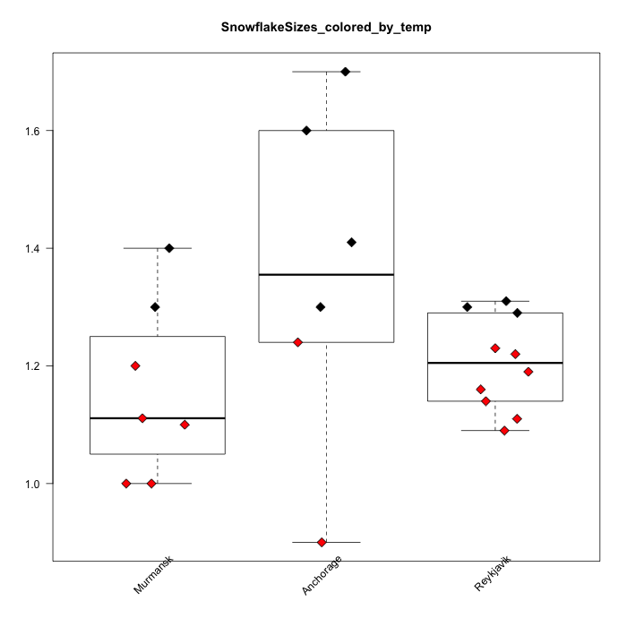
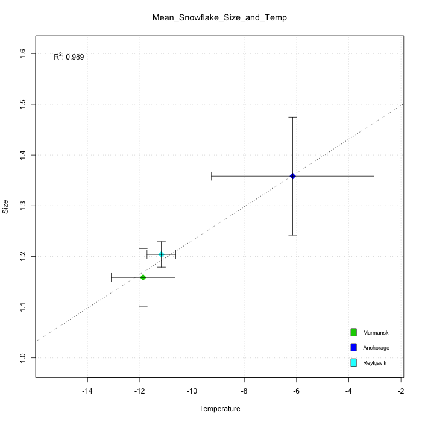

#  Snowflakes

		Modified: 02/08/2018 | 12:44 | by: MarkdownReports_in_Action.r

_I will show an (imaginary) example workflow on complitely made up data._


### This example is for MarkdownReports v3.1

Other major version (v2, v4-dev) might not run !


### Hey Snowflake collector, welcome back from Reykjavik! How big are the snowflakes over there?

Take a look at the raw numbers:

####  SnowflakeSizes_Reykjavik

|  09-Jan 	| 10-Jan 	| 11-Jan 	| 12-Jan 	| 15-Jan 	| 16-Jan 	| 17-Jan 	| 18-Jan 	| 19-Jan 	| 20-Jan 	| 21-Jan 	| 22-Jan 	| 23-Jan  |
| ---| ---| ---| ---| ---| ---| ---| ---| ---| ---| ---| ---| --- |
| 1.21 	| 1.31 	| 1.14 	| 1.3 	| 1.11 	| 1.09 	| 1.22 	| 1.19 	| 1.31 	| 1.16 	| 1.19 	| 1.23 	| 1.29  |

The code:
```
md.tableWriter.VEC.w.names(SnowflakeSizes_Reykjavik)
```

Let's visualize them:


The code:
```
wbarplot(SnowflakeSizes_Reykjavik)
```
NOTE: use the `mdlink = FALSE` argument if you don not want to save this specific plot.
       See wiki for more

### At first we would like to throw away every  measurement where the measurement bias (reported by your snowflake collecting machine) is above 10%:



76.9 % or 10 of 13 entries in Measurement_Bias fall below a threshold value of: 10

The code:
```
wbarplot(Measurement_Bias, ylab = "Measurement Bias (%)", hline = thresholdX, filtercol = -1)
barplot_label(Measurement_Bias, TopOffset = 2)
```



The code:
```
wpie(Nr_of_measurements, both_pc_and_value = F)
```

### Let's see how it compares with snow flakes from other cities?




The code:
```
wstripchart(SnowflakeSizes, tilted_text = T)
```



The code:
       ```
       wvioplot_list(SnowflakeSizes, tilted_text = T, yoffset = -.2)
       ```

### Let's say, we also measured the temperature of the flakes. We can color flakes that had temperature below -10:



The code:
```
SnowflakeTemperature = list( c(-13.3, -13.1, -11.4, -15, -15, -6.28, -9.02),
							 c(-9.02, -5.98, -10.5, 0.48, 4.56, -16.4),
       c(-8.76, -12.6, -9.02, -13.2, -13.5, -10.9, -12.2, -11.6, -10.7, -9.27) )

       colz = lapply(SnowflakeTemperature, function(x) (x< -10)+1)
       SnowflakeSizes_colored_by_temp = SnowflakeSizes
       wstripchart_list(SnowflakeSizes_colored_by_temp, tilted_text = T, bg = colz)

```

### And let's see how the correlation looks like for snowflakes in each city:



The code:
```Snowflakes = cbind(
	"Temperature" = unlist(SnowflakeTemperature),
       "Size" = unlist(SnowflakeSizes)
)

Mean_Snowflake_Size_and_Temp = cbind(
"Temperature" = unlist(lapply(SnowflakeTemperature, mean)),
"Size" = unlist(lapply(SnowflakeSizes, mean))
)

sem <- function(x, na.rm=T) sd(unlist(x), na.rm = na.rm)/sqrt(length(na.omit.strip(as.numeric(x))))  # Calculates the standard error of the mean (SEM) for a numeric vector (it excludes NA-s by default)
Snowflakes_SEM = cbind(
"Temperature" = unlist(lapply(SnowflakeTemperature, sem)),
"Size" = unlist(lapply(SnowflakeSizes, sem))
)

llprint("### And lets see how the correlation looks like for snowflakes in each city:")
wplot(Mean_Snowflake_Size_and_Temp, errorbar = T, upper = Snowflakes_SEM[,"Size"], left = Snowflakes_SEM[,"Temperature"], col =3:5, cex=2)

legend_=3:5
names(legend_) = rownames(Mean_Snowflake_Size_and_Temp)
wlegend( fill_= legend_, poz = 3,bty="n")

# linear regression and correlation coefficient
wLinRegression(Mean_Snowflake_Size_and_Temp, lty=3 )
```


